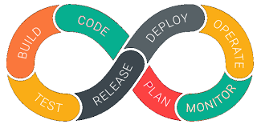

@snap[midpoint]
# Demystifying CI/CD 
@snapend
---
# Some clever story


---
# "DevOps"


---
# So about CI/CD...

Note:
I've been part of development teams where code would take weeks or months before it was pushed to testing, and often months before it would be deployed to production. And that was just one team, working on one feature, while other teams worked on other features doing the same thing. It was also not uncommon to be working on a project for a year - only to have it dumped because the business and/or customer had already moved past the need. Who here would prefer slow code delivery cycles? Every technology delivery team wants to increase their code delivery velocity and the quality of the code they push to market.

---
## TickTock


Note:
Time is a dev's most important and valuable asset. If we don't manage our time properly, then we're not able to accomplish our goals, finish our projects per their deadlines, right? And we'll also run the risk of, you know, failing our team in regards to delivering tasks and software, right? Often times devs get wrapped up in our own heads sometimes, you know, when we're doing a pretty intensive work on trying to fix bugs manually, and we encounter these moments that we'll call time sucks, right? Where we're just spinning our wheels, right. We're looking for bugs, for problems within the code base. And a lot of times we can leverage some other tooling, right, to help us with these these time sucks that we get ourselves into.


---
@snap[midpoint]
## Continuous {Integration|Delivery}
@snapend

Note:
CI/CD are Principles & Practices that enable teams to release quality code
Fail Fast is the most important here. The ability to know when stuff is broken is invaluable. It leads to faster fixes and delivery of quality code. Quickly fix issues, resubmit fixes. Deliver stable code consistently.


---
@snap[west span-45 text-center]
## "CI"
@snapend

@snap[east span-55 text-8 text-center]
@ul[list-spaced-bullets](false)
- Merge code changes often
- Run automated tests to validate builds
- Only integrate tested code into code base
- Changes frequently merged into release branches
@ulend
@snapend

Note: 
Continuous integration is the practice where developers are merging code often to a shared code base. Meaning, if you have a repo on GitHub and you have, let’s say ten developers, all ten developers will branch from that shared code base and they’ll have an individual siloed based on their development environments. And, as they’re writing code they are continuously pushing code up into this shared code base. The reason for that is sometimes when we write code it can take us a week, two weeks, whatever the time frame is and what that means is if you are developing in isolation the rest of your team doesn’t really know what’s happening until push those changes upstream, right, to that upstream repo. So that, they can pull them down and see what’s going on. By doing so the team is more informed about what each other’s code base looks like and the potential future conflicts that could arise. So as developers are merging codebase changes often, we want to run automated tests, right, automated tests to validate these builds. So, as you’re pushing your code base up stream we’re definitely inclined to start running these automated tests to insure the code that you’re pushing is actually of quality. Again, only tested code is integrated into the code base and then the merge of these changes are frequently released to our production branch or our release branch. Continuous integration gets us a speed in a sense that, you know, once you write some code, you push it up stream and automation takes over, and it them validates those builds to insure that you’re only pushing quality code into the production branches. 


---
@snap[west span-45 text-center]
## "CD"
@snapend

@snap[east span-55 text-8 text-center]
@ul[list-spaced-bullets](false)
- Faster release cycles
- Low-risk releases
- Higher quality
- Lower costs
@ulend
@snapend


Note:
Now, continuous delivery is basically automation that helps us with releasing our software faster. Actually, in most occasions smarter, and it's also ensuring that we are lowering risks to our release processes. The code and the software being released should be, it should be at a higher quality. And then by using these continuous delivery mechanisms you're actually lowering your costs. You're lowering the cost for time for your developers. You should be lowering your costs for actual billable items such as, time spent delivering software to multiple infrastructures. Could be that you're delivering software to staging. Could be delivering software to maybe a QA type of environment. And then you're also lowering costs to delivering software to your production level infrastructures.

---
### So now can I CI/CD?

Note:
As we mentioned when defining DevOps as a term, much has changed in the way that developers build and ship code. In implementing CI/CD, you're implementing practices and principles which aren't really about tooling. It's important that you and your teams sit down and decide how you will implememnt CI/CD practices and principles. CI/CD aims to break down the walls between Dev and Ops and get everyone on the same page working together. You don't have to implement CI/CD all at once. Instead, thing about it as iterative in and of itself. The systems and tech currently in place in your organization, combined with the culture (which in itself might need to be reformed) dramatically incluence the customization needed to implement.

---
## DevOps Lifecycle

@snap[midpoint]

@snapend

Note:

 Who here is familiar with the DevOps Lifecycle?


### Add Some Slide Candy


---?color=linear-gradient(180deg, white 75%, black 25%)
@title[Customize Slide Layout]

@snap[west span-55]
## Customize the Layout
@snapend

@snap[north-east span-45]

@snapend

@snap[south span-100]
Snap Layouts let you create custom slide designs directly within your markdown.
@snapend

---
@title[Add A Little Imagination]

@snap[north-west span-50 text-center]
#### Engage your Audience
@snapend

@snap[west span-55]
@ul[list-spaced-bullets text-09]
- You will be amazed
- What you can achieve
- With a **little imagination**
- And GitPitch Markdown
@ulend
@snapend

@snap[east span-45]

@snapend

@snap[south span-100 bg-black fragment]
@img[shadow](assets/img/conference.png)
@snapend

---

@snap[north-east span-100 text-pink text-06]
Let your code do the talking!
@snapend

```sql zoom-18
CREATE TABLE "topic" (
    "id" serial NOT NULL PRIMARY KEY,
    "forum_id" integer NOT NULL,
    "subject" varchar(255) NOT NULL
);
ALTER TABLE "topic"
ADD CONSTRAINT forum_id
FOREIGN KEY ("forum_id")
REFERENCES "forum" ("id");
```

@snap[south span-100 text-gray text-08]
@[1-5](You can step-and-ZOOM into fenced-code blocks, source files, and Github GIST.)
@[6,7, zoom-13](Using GitPitch live code presenting with optional annotations.)
@[8-9, zoom-12](This means no more switching between your slide deck and IDE on stage.)
@snapend


---?image=assets/img/code.jpg&opacity=60&position=left&size=45% 100%

@snap[east span-50 text-center]
## Now It's **Your** Turn
@snapend

@snap[south-east span-50 text-center text-06]
[Download GitPitch Desktop @fa[external-link]](https://gitpitch.com/docs/getting-started/tutorial/)
@snapend

